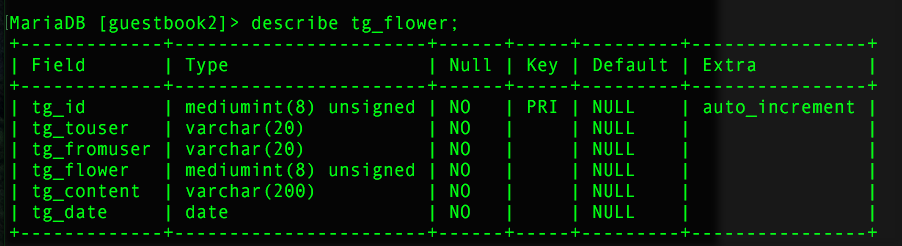

#多用户留言系统
####这是我在学习PHP过程中跟着李炎恢老师的视频写的留言板系统
##介绍：
功能：

* 游客状态：

	1. 查看当前系统所有注册会员。
	2. 首页查看新注册会员，新上传图片以及论坛内最新几条帖子。
	3. 首页查看所有会员发表的帖子。
* 登录状态：
	1. 首页可看到自己未读别人发给自己的消息数目，并可点击直接进入消息页面查看。
	2. 在个人管理中心可修改自己的``` 用户名 ```，``` 密码 ```，``` 头像 ```等信息。
	3. 在个人管理中心可查看所有其他会员发给自己的``` 消息 ```，``` 留言 ```，``` 花朵 ```以及``` 所有好友 ```并进行管理。
	4. 博友页面不但可以看到所有论坛注册会员，并且可以对特定会员进行``` 发消息 ```，``` 送花 ```，``` 留言 ```以及``` 加好友 ```操作。
	5. 发表帖子
	
<hr />
使用介绍：

数据库修改在``` include ```文件夹里的``` common.inc.php ```文件。

各个数据表结构：

tg_user表：


tg_message表：


tg_friend表：


tg_flower表：


tg_article表：


tg_dir表：


tg_photo表:
